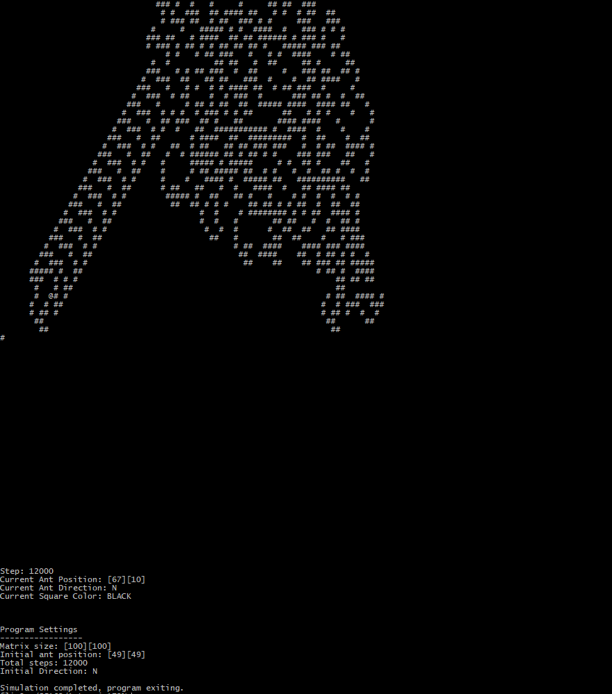

# CPP-Ant
C++ Turning Machine Project

Originally invented by Chris Langton in 1986, this Turing machine demonstrates a path of order emerging out of chaos.

Starting on a white (or black) tiled board an "ant" placed on it will move according to set rules.

1.  If the ant is on a white square, it will turn right and move forward one step. The previous square color will flip.
2.  If the ant is on a black square, it will turn left and move forward one step. The previous square color will flip.
Based on these rules what looks to be a random pattern of squares eventually emerges into a repeatable "highway" out of the chaos.

How to operate:
1. Enter in the command line git clone https://github.com/hso4/CPP-Ant.git
2. Opening the project on a Linux console, the makefile will designate the executable as "runAnt"
3. Entering 1 will allow a customizable board. 2 will initiate a preset board for 12,000 steps. The pattern will be visible near the end, so allow the program to finish running.
4. If customizing the board, a larger board with more steps will make the emergent behavior easier to see
5. End the program via the main menu or ctrl+C to end it while the board is printing.

# Possibly your final view(depending on settings):

